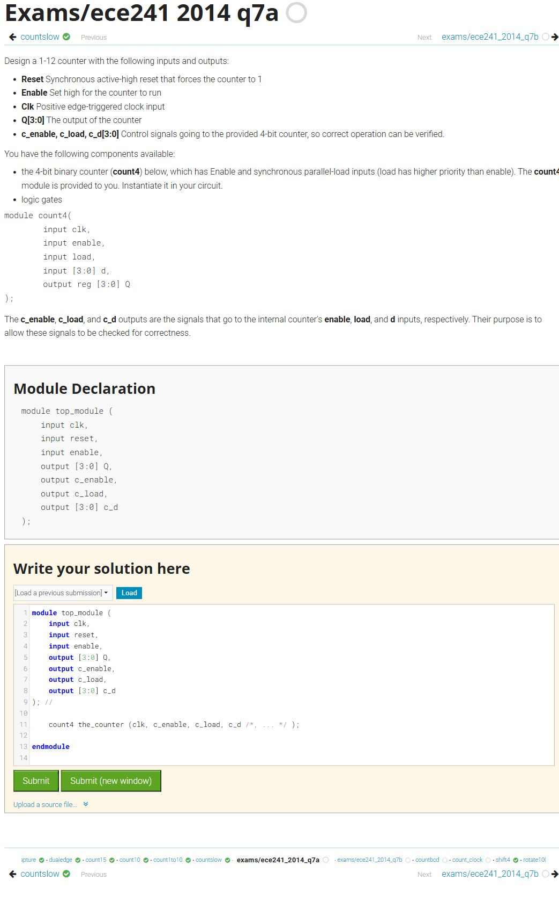
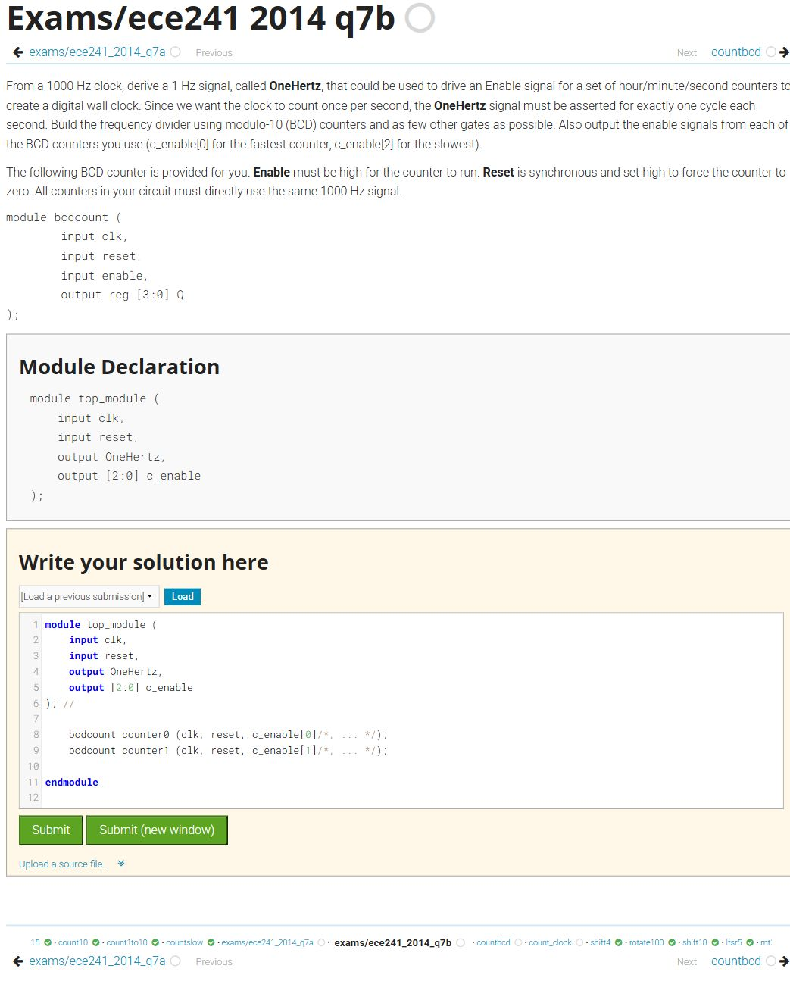
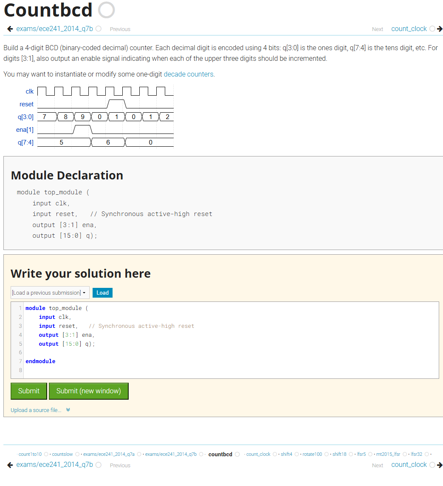
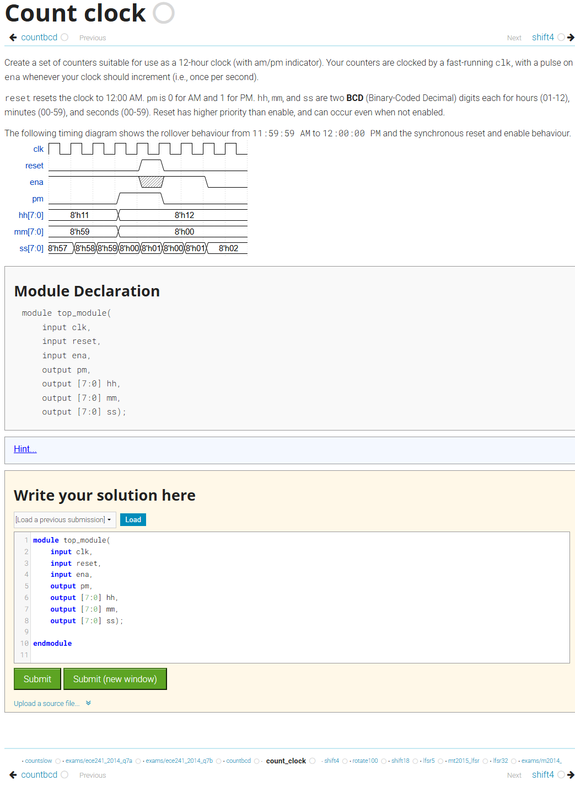

# HDLBits Review Queue

These items are deliberately excluded from the completed archive. The four unfinished counter questions are marked **To Do**; `lemmings2` and `exams/2013_q2afsm` are marked **Review** because they have attempts but no successful submission.

| Status | Problem | HDLBits ID | Attempts | Screenshot | Source |
|---|---|---|---:|---|---|
| Review | Lemmings 2 | `lemmings2` | 7 | [Complete screenshot](images/Review/120-lemmings2.png) | [HDLBits](https://hdlbits.01xz.net/wiki/lemmings2) |
| Review | Q2a: FSM | `exams/2013_q2afsm` | 3 | [Complete screenshot](images/Review/review-exams__2013_q2afsm.png) | [HDLBits](https://hdlbits.01xz.net/wiki/exams/2013_q2afsm) |
| To Do | Counter 1-12 | `exams/ece241_2014_q7a` | 0 | [Complete screenshot](images/Review/todo-exams__ece241_2014_q7a.png) | [HDLBits](https://hdlbits.01xz.net/wiki/exams/ece241_2014_q7a) |
| To Do | Counter 1000 | `exams/ece241_2014_q7b` | 0 | [Complete screenshot](images/Review/todo-exams__ece241_2014_q7b.png) | [HDLBits](https://hdlbits.01xz.net/wiki/exams/ece241_2014_q7b) |
| To Do | 4-digit decimal counter | `countbcd` | 0 | [Complete screenshot](images/Review/todo-countbcd.png) | [HDLBits](https://hdlbits.01xz.net/wiki/countbcd) |
| To Do | 12-hour clock | `count_clock` | 0 | [Complete screenshot](images/Review/todo-count_clock.png) | [HDLBits](https://hdlbits.01xz.net/wiki/count_clock) |

## Review: Lemmings 2

[Open complete screenshot](images/Review/120-lemmings2.png) · [Open HDLBits problem](https://hdlbits.01xz.net/wiki/lemmings2)

This problem has 7 unsuccessful attempts and should be reviewed before continuing to Lemmings 3. The captured editor contains the last non-successful submission for debugging, but no draft is presented as a completed solution.

---

## Review: Q2a: FSM

[Open complete screenshot](images/Review/review-exams__2013_q2afsm.png) · [Open HDLBits problem](https://hdlbits.01xz.net/wiki/exams/2013_q2afsm)

This arbiter FSM has 3 unsuccessful attempts and should be reviewed before continuing with the adjacent Q2b FSM exercise. The captured page preserves the full state diagram, prompt, module declaration, and editor context without presenting it as a completed solution.

---

## To Do: Counter 1-12

[Open complete screenshot](images/Review/todo-exams__ece241_2014_q7a.png) · [Open HDLBits problem](https://hdlbits.01xz.net/wiki/exams/ece241_2014_q7a)

This counter problem has not been attempted yet. Its full question and starter module are captured here so it can be reviewed and solved without losing its place in the course sequence.

---

## To Do: Counter 1000

[Open complete screenshot](images/Review/todo-exams__ece241_2014_q7b.png) · [Open HDLBits problem](https://hdlbits.01xz.net/wiki/exams/ece241_2014_q7b)

This counter problem has not been attempted yet. Its full question and starter module are captured here so it can be reviewed and solved without losing its place in the course sequence.

---

## To Do: 4-digit decimal counter

[Open complete screenshot](images/Review/todo-countbcd.png) · [Open HDLBits problem](https://hdlbits.01xz.net/wiki/countbcd)

This counter problem has not been attempted yet. Its full question and starter module are captured here so it can be reviewed and solved without losing its place in the course sequence.

---

## To Do: 12-hour clock

[Open complete screenshot](images/Review/todo-count_clock.png) · [Open HDLBits problem](https://hdlbits.01xz.net/wiki/count_clock)

This counter problem has not been attempted yet. Its full question and starter module are captured here so it can be reviewed and solved without losing its place in the course sequence.
