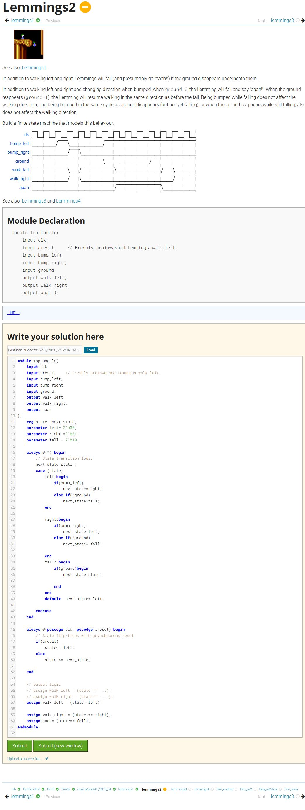
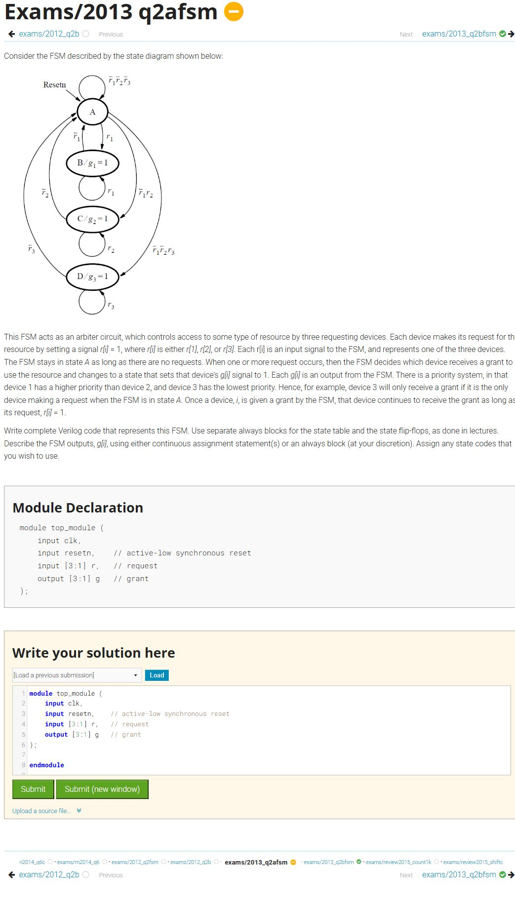

# HDLBits Review Queue

These two attempted problems remain deliberately excluded from the completed archive because neither has a successful submission yet. The four counter questions previously listed here were completed and moved into Days 08 and 09.

| Status | Problem | HDLBits ID | Attempts | Screenshot | Source |
|---|---|---|---:|---|---|
| Review | Lemmings 2 | `lemmings2` | 7 | [Complete screenshot](images/Review/120-lemmings2.png) | [HDLBits](https://hdlbits.01xz.net/wiki/lemmings2) |
| Review | Q2a: FSM | `exams/2013_q2afsm` | 3 | [Complete screenshot](images/Review/review-exams__2013_q2afsm.png) | [HDLBits](https://hdlbits.01xz.net/wiki/exams/2013_q2afsm) |

## Review: Lemmings 2

[Open complete screenshot](images/Review/120-lemmings2.png) · [Open HDLBits problem](https://hdlbits.01xz.net/wiki/lemmings2)

This problem has 7 unsuccessful attempts and should be reviewed before continuing to Lemmings 3. The captured editor contains the last non-successful submission for debugging, but no draft is presented as a completed solution.

---

## Review: Q2a: FSM

[Open complete screenshot](images/Review/review-exams__2013_q2afsm.png) · [Open HDLBits problem](https://hdlbits.01xz.net/wiki/exams/2013_q2afsm)

This arbiter FSM has 3 unsuccessful attempts and should be reviewed before continuing with the adjacent Q2b FSM exercise. The captured page preserves the full state diagram, prompt, module declaration, and editor context without presenting it as a completed solution.
