# HDLBits Mistakes and Weaknesses Log

This file turns the pasted debugging screenshots into a revision log. I kept the screenshots that are directly useful for HDLBits or HDL/Verilog coding practice, moved them into `images/Mistakes/`, and removed screenshots that were unrelated to HDLBits/HDL practice or exposed private account information.

Use this file as a weakness tracker, not only as a list of old errors. The important pattern is the mental model behind each mistake: whether the code describes hardware, how many bits each signal has, which cycle a value belongs to, and what state the circuit must remember.

## Weakness Map

| Weakness | How it appeared in the screenshots | Habit to build |
|---|---|---|
| Mixing continuous and procedural assignment | `assign` was placed inside an `always` block, and outputs declared as `wire` were driven procedurally. | Decide first: is this a continuous wire equation, combinational procedural logic, sequential storage, or a testbench stimulus? Then choose `assign`, `always @(*)`, `always @(posedge clk)`, or `initial`. |
| Bit order and width mistakes | Part-selects used `[8:15]`, concatenations used unsized `1`, and packed BCD digit slices were written as variable ranges. | Write the declared range beside every slice. Count widths before coding. Use indexed part-selects such as `[base +: width]` for generate loops. |
| C-style boolean thinking | `&&`, `||`, and the English `or` were used where bit-level hardware operators were required. | Use `&`, `|`, `^`, `~` for bit logic. Use `&&`/`||` only when you intentionally want a one-bit true/false result from whole expressions. |
| Pattern priority confusion | `casez` patterns put don't-cares on the wrong side, so higher-numbered bits overrode lower-priority bits. | For priority encoders, write one example input for every pattern and ask which earlier pattern catches it. |
| Incomplete generated hardware | Repeated instances had empty ports or reused the same instance name; carries were not chained. | Draw the instance chain first: each module instance must have a unique name, connected inputs, connected outputs, and a named intermediate wire if data must pass forward. |
| Latch vs flip-flop confusion | Level-sensitive behavior was implemented using `posedge`/`negedge` edge-triggered blocks. | If the waveform says "follows while clock is high/low", think latch. If it says "samples only at an edge", think flip-flop. |
| FSM state under-modeling | Inputs were treated as state names, and direction/output history was not stored. | State is memory, not the current input. If the output depends on history, create states that remember that history. |
| Mixing FSM control and datapath storage | The complete-timer attempt wrote `delay` and `counting` from selected next-state branches. | Let the FSM choose the phase. Update shift registers and counters in separate clocked datapath blocks, and decode Moore outputs from current state. |
| Nonblocking old-value confusion | A newly shifted `delay` value was expected to be visible to another `<=` assignment on the same edge. | Every nonblocking right-hand side sees pre-edge values. Reuse the full next-value expression or avoid the duplicate register. |
| Testbench structure confusion | A module was instantiated inside an `initial` loop. | Instantiate the DUT once at module scope. Use `initial`/`always` only to drive stimulus and clocks over time. |

## 1. Assignment Context: Wires, `assign`, and `always`

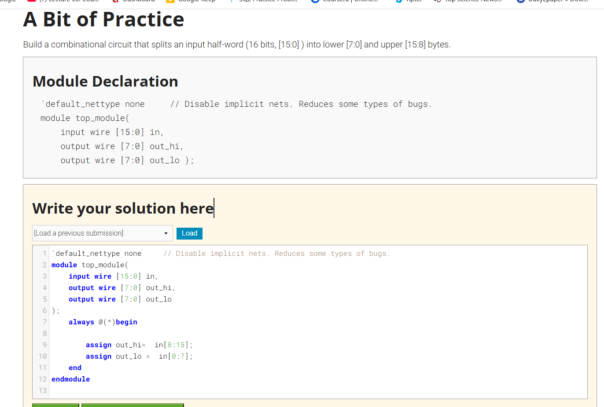

The vector split screenshot shows two separate mistakes at the same time:

1. `assign` was placed inside `always @(*)`.
2. The part-select direction was reversed: `in[8:15]` and `in[0:7]` do not match a vector declared as `[15:0]`.

In Verilog, `assign` is a continuous assignment. It lives at module scope and describes a permanent driver from the right-hand expression to the left-hand net. An `always` block is procedural logic. Inside it you write procedural assignments such as `out_hi = ...`, but then the destination must be a procedural variable (`reg` in Verilog-2001, `logic` in SystemVerilog).

For this HDLBits problem there is no need for procedural logic. The circuit is just two wires sliced out of one bus:

```verilog
assign out_hi = in[15:8];
assign out_lo = in[7:0];
```

The deeper issue is that HDL code is not executed like a C program. A continuous assignment is not "a statement that runs"; it is a hardware connection. An `always @(*)` block is still hardware, but it describes a block of combinational logic whose outputs are recomputed when inputs change. Putting `assign` inside `always` mixes two different kinds of drivers.

### What to remember

- Use `assign` for simple wire equations.
- Use `always @(*)` when the combinational logic is easier to write as `if`/`case`.
- Use `always @(posedge clk)` only when the circuit stores a value on a clock edge.
- With `input [15:0] in`, the upper byte is `[15:8]` and the lower byte is `[7:0]`. Do not reverse the range unless the declaration itself is ascending.

## 2. Verilog Operators Are Not English or C++

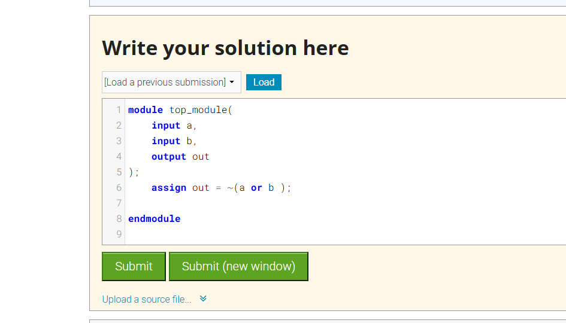

The NOR screenshot used:

```verilog
assign out = ~(a or b);
```

That is not the right expression syntax for Verilog. Verilog has gate primitives named `and`, `or`, `not`, etc., but those are used as instantiated primitives:

```verilog
or g1(w, a, b);
not g2(out, w);
```

Inside an expression, use operators:

```verilog
assign out = ~(a | b);
```

For scalar one-bit signals, `|` and `||` may appear to produce the same answer for clean 0/1 inputs, but they mean different things. `|` is bitwise OR. It preserves bit-level hardware meaning and also works naturally for vectors. `||` is logical OR: it reduces each side to true/false and returns one bit. HDLBits problems often start with one-bit examples, but later the exact same habit must work on vectors. Building the habit around `&`, `|`, `^`, and `~` is safer.

## 3. Concatenation and Literal Widths

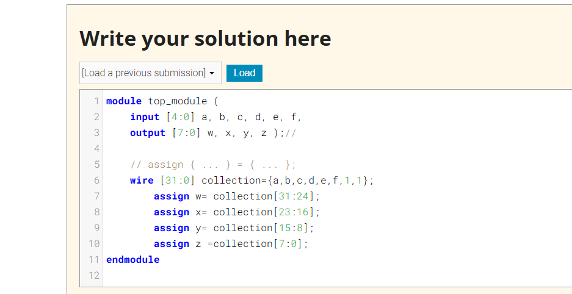

The concatenation attempt built a 32-bit collection from six 5-bit inputs and two constants:

```verilog
wire [31:0] collection = {a, b, c, d, e, f, 1, 1};
```

The intended math is:

- six vectors of 5 bits = 30 bits
- two constant 1 bits = 2 bits
- total = 32 bits

The mistake is that plain `1` is an unsized integer constant. In Verilog, unsized constants can be much wider than one bit, and many tools reject unsized constants inside concatenations because their width is ambiguous. The hardware you meant is two single-bit constants:

```verilog
assign {w, x, y, z} = {a, b, c, d, e, f, 2'b11};
```

or:

```verilog
assign {w, x, y, z} = {a, b, c, d, e, f, 1'b1, 1'b1};
```

The deeper rule is: every concatenation is a bit-packing operation. Before writing it, count the width of every operand. If the left side is 32 bits, the right side should visibly add to 32 bits.

## 4. Adders and Borrow Logic: Derive the Equation, Do Not Guess It

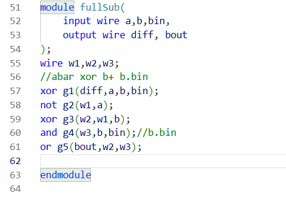

The full subtractor screenshot correctly used:

```verilog
diff = a ^ b ^ bin;
```

but the borrow logic was built from an intermediate `(~a ^ b)` and then ORed with a term containing itself. That collapses into the wrong function. A full subtractor computes:

```text
a - b - bin
```

Borrow-out is 1 when `a` cannot cover `b + bin`. The standard expression is:

```verilog
assign bout = (~a & b) | (~(a ^ b) & bin);
```

Equivalent form:

```verilog
assign bout = (~a & (b | bin)) | (b & bin);
```

Why this works:

- `~a & b`: if `a=0` and `b=1`, you must borrow regardless of `bin`.
- `~(a ^ b) & bin`: if `a` and `b` are equal, subtracting the borrow-in decides whether another borrow is needed.
- The OR combines the two situations where the next higher bit must lend.

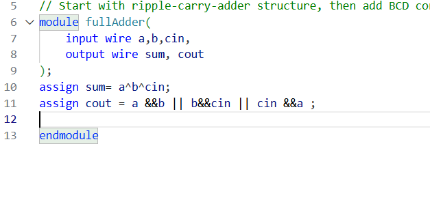

For a full adder, the sum is parity and the carry is majority:

```verilog
assign sum  = a ^ b ^ cin;
assign cout = (a & b) | (a & cin) | (b & cin);
```

The screenshot used `&&` and `||`. For one-bit inputs, it may simulate correctly, but it trains the wrong habit. Full adders are bit-level circuits. The carry is not a C boolean condition; it is an OR of AND gates. Use bitwise operators.

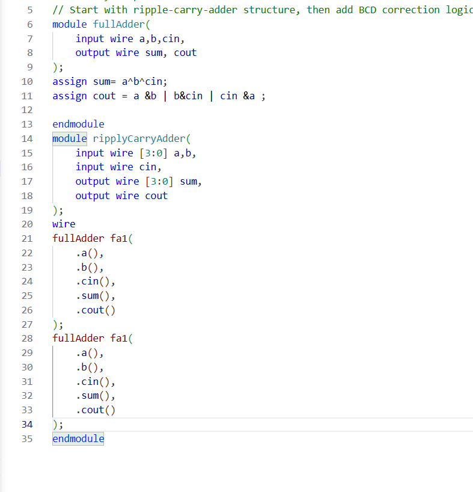

The ripple-carry attempt also shows a structural weakness: instances were declared but their ports were empty. A module instance is a real piece of hardware. If you instantiate four full adders, each one needs:

- its own instance name,
- its own input bit connections,
- its own sum output connection,
- and a carry wire that connects it to the next stage.

Correct pattern:

```verilog
wire [4:0] carry;
assign carry[0] = cin;

genvar i;
generate
    for (i = 0; i < 4; i = i + 1) begin : gen_fa
        fullAdder fa (
            .a(a[i]),
            .b(b[i]),
            .cin(carry[i]),
            .sum(sum[i]),
            .cout(carry[i+1])
        );
    end
endgenerate

assign cout = carry[4];
```

The key idea: ripple-carry is a chain, not a loop that "runs." The generate loop creates four parallel pieces of hardware at elaboration time. The carry wire is what makes the stages dependent.

## 5. Generate Loops and Indexed Part-Selects

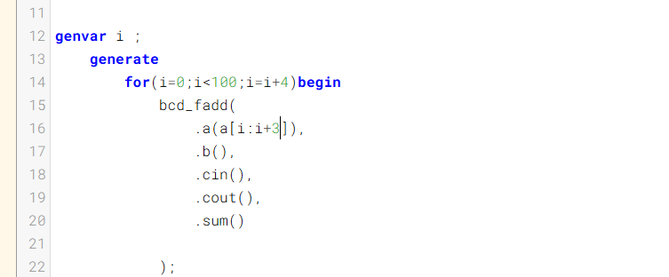

In the BCD adder screenshot, the code tried to connect one decimal digit using:

```verilog
.a(a[i:i+3])
```

There are two problems:

1. A normal part-select range cannot have both endpoints changing like that.
2. For `input [399:0] a`, each BCD digit is 4 bits, so the digit base is `4*digit`, not just `digit`.

Use indexed part-select syntax:

```verilog
a[digit*4 +: 4]
```

This means: start at bit `digit*4`, take 4 bits upward. For 100 BCD digits:

```verilog
wire [100:0] carry;
assign carry[0] = cin;
assign cout = carry[100];

genvar digit;
generate
    for (digit = 0; digit < 100; digit = digit + 1) begin : gen_bcd
        bcd_fadd fa (
            .a(a[digit*4 +: 4]),
            .b(b[digit*4 +: 4]),
            .cin(carry[digit]),
            .sum(sum[digit*4 +: 4]),
            .cout(carry[digit+1])
        );
    end
endgenerate
```

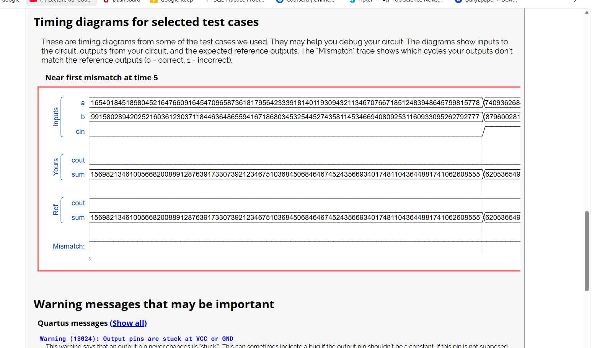

The stuck-output warning is a good example of how to read tool output. A stuck pin is not always wrong, but it means the tool sees an output that never changes in the tested/synthesized logic. In an adder problem, that often points to one of these:

- a port is left unconnected,
- the final carry is never assigned,
- the loop creates fewer stages than expected,
- the same slice is reused repeatedly,
- or the output is tied to a constant by accident.

Do not ignore warnings. First ask whether the output is supposed to be constant. If not, trace its driver backward.

## 6. Priority Encoders and `casez`

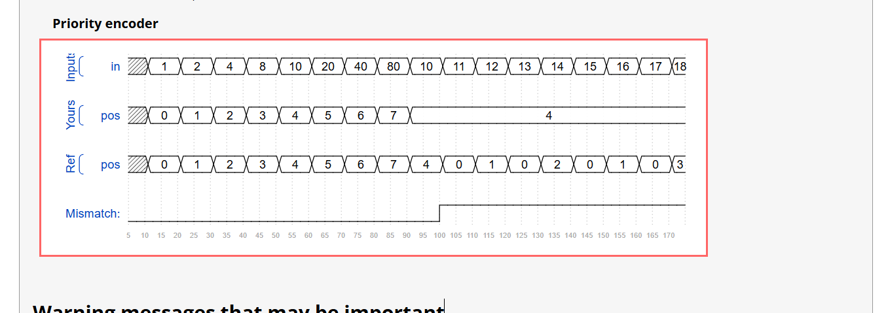

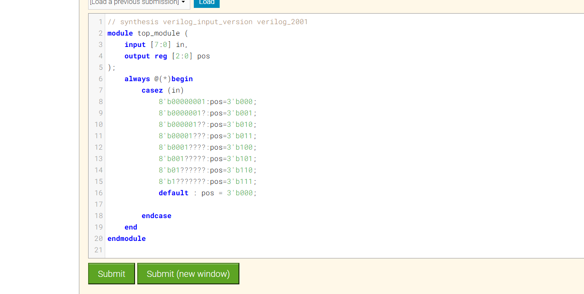

The mismatch shows that values like `8'h10`, `8'h11`, `8'h12`, etc. were being classified as position 4 for too many cases. The reason is the `casez` pattern direction.

The attempted patterns were shaped like:

```verilog
8'b0001????: pos = 3'b100;
```

This says: "if bit 4 is 1, I do not care what the lower bits are." But this HDLBits priority encoder expects the lowest asserted bit to win. For `8'b00010001`, bit 0 should win, not bit 4. Therefore the don't-cares belong on the higher side, while lower-priority bits must be fixed to 0 for later cases:

```verilog
always @(*) begin
    casez (in)
        8'b???????1: pos = 3'd0;
        8'b??????10: pos = 3'd1;
        8'b?????100: pos = 3'd2;
        8'b????1000: pos = 3'd3;
        8'b???10000: pos = 3'd4;
        8'b??100000: pos = 3'd5;
        8'b?1000000: pos = 3'd6;
        8'b10000000: pos = 3'd7;
        default:     pos = 3'd0;
    endcase
end
```

The weakness here is not `casez` itself. The weakness is not testing your mask mentally against a concrete input. Before submitting a priority encoder, test at least these inputs by hand: `8'b00000001`, `8'b00000010`, `8'b00000011`, `8'b00010001`, and `8'b00000000`.

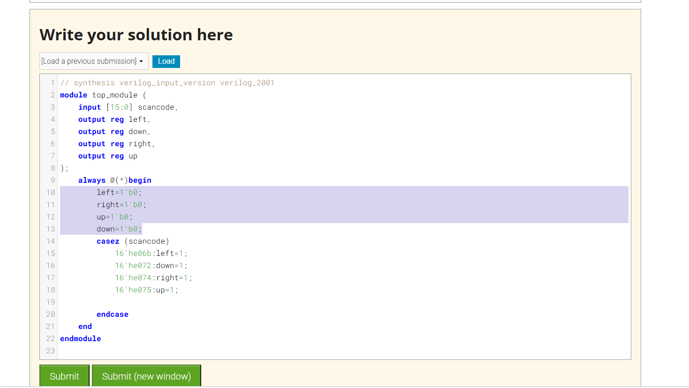

This scancode screenshot is a good pattern: default all outputs to zero before the `case`, then set only the matched output. That prevents accidental latches and makes unmatched input codes behave predictably.

## 7. K-Maps Feeding Multiplexers

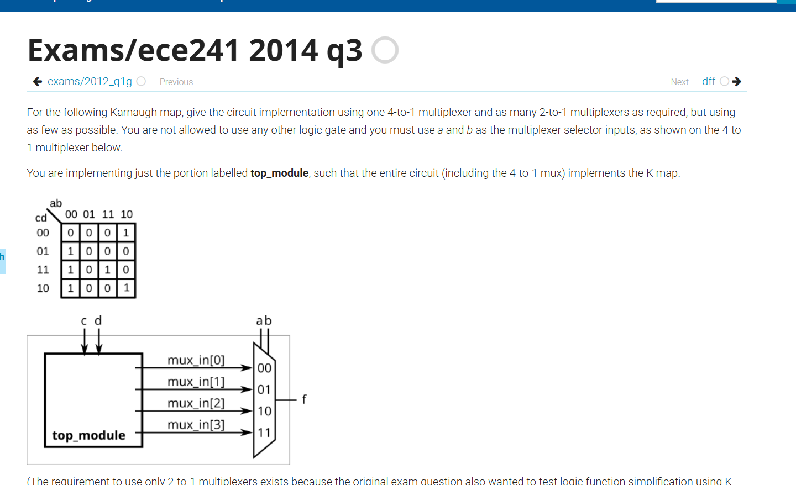

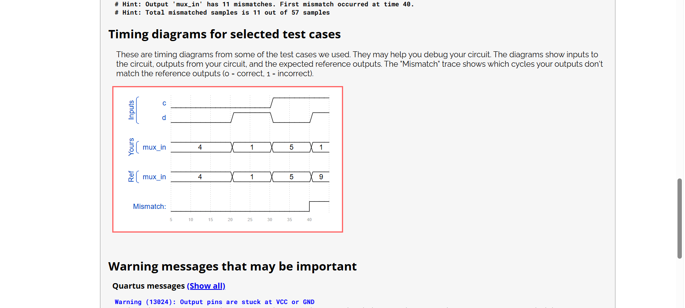

The mux K-map problem is easy to get wrong because K-map columns are arranged in Gray-code order, but mux select inputs use binary order.

The K-map columns are labelled:

```text
ab = 00, 01, 11, 10
```

The mux inputs are selected by `ab` in binary:

```text
00 -> mux_in[0]
01 -> mux_in[1]
10 -> mux_in[2]
11 -> mux_in[3]
```

So you cannot blindly copy the K-map columns left to right into `mux_in[0]`, `mux_in[1]`, `mux_in[2]`, `mux_in[3]`. You must derive each mux input as a function of `c` and `d`.

From the screenshot:

- For `ab=00`, the column is 0 only at `cd=00`, so `mux_in[0] = c | d`.
- For `ab=01`, the column is all 0, so `mux_in[1] = 1'b0`.
- For `ab=10`, the column is 1 when `d=0`, so `mux_in[2] = ~d`.
- For `ab=11`, the column is 1 only when `c=1` and `d=1`, so `mux_in[3] = c & d`.

Correct pattern:

```verilog
assign mux_in[0] = c | d;
assign mux_in[1] = 1'b0;
assign mux_in[2] = ~d;
assign mux_in[3] = c & d;
```

The mismatch trace expecting decimal values `4, 1, 5, 9` is a useful debug clue. Those are the packed 4-bit mux input values for different `cd` combinations. When your output got `1` where the reference got `9`, bit 3 was missing, which points directly at `mux_in[3] = c & d`.

## 8. Latches vs Flip-Flops

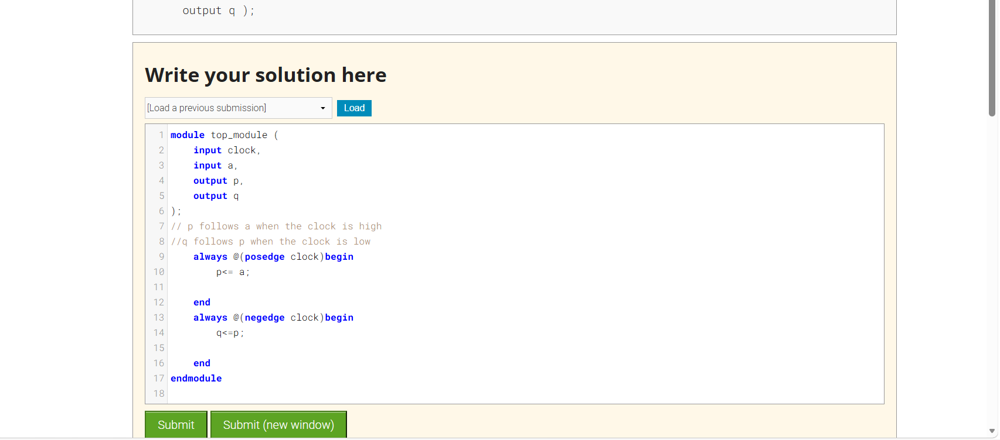

The comments in the screenshot say:

- `p` follows `a` when the clock is high.
- `q` follows `p` when the clock is low.

That is latch behavior, not flip-flop behavior. A D flip-flop samples once at a clock edge. A latch is transparent during an enable level. If `a` changes several times while `clock` is high, a high-level latch follows those changes. A `posedge` block will not.

So this kind of circuit should be described as intentional latch inference:

```verilog
always @(*) begin
    if (clock)
        p = a;
end

always @(*) begin
    if (!clock)
        q = p;
end
```

In Verilog-2001, `p` and `q` must be declared as procedural variables:

```verilog
output reg p,
output reg q
```

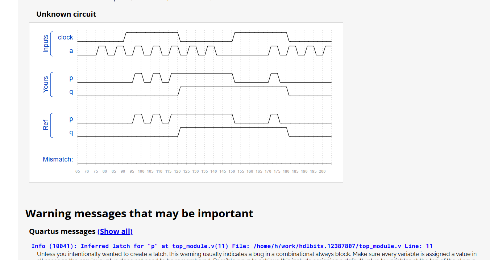

This warning is important because it teaches nuance. Most of the time, an inferred latch warning means a combinational block forgot to assign an output in every path. But in this specific waveform problem, a latch is the intended hardware. The right reaction is not "warnings are bad" or "warnings are fine"; the right reaction is to classify the warning against the problem statement.

### Latch checklist

- Does the output follow input during a clock level, not just at an edge?
- Does the output hold its old value when the enable is inactive?
- Is the incomplete `if` intentional?
- Did you declare the procedural output as `reg`?

If all are yes, the latch warning is expected. If not, it is probably a bug.

## 9. Edge Detection, Shift Registers, and LFSRs

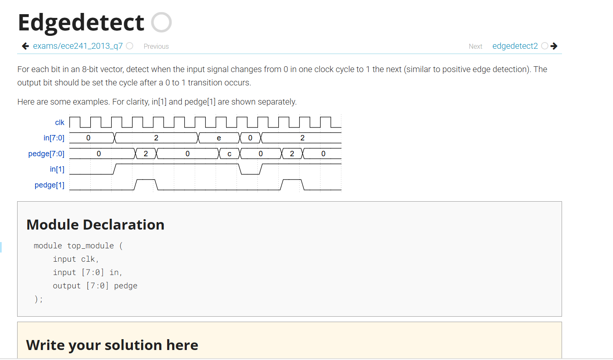

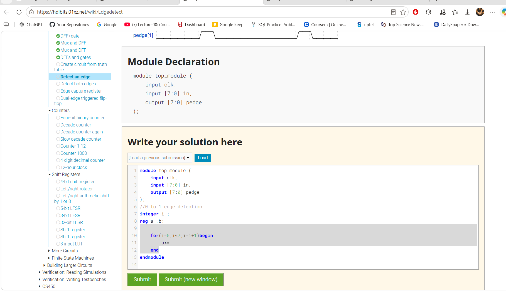

For edge detection, the output depends on both the current input and the previous sampled input. That means you need memory:

```verilog
reg [7:0] prev;

always @(posedge clk) begin
    pedge <= ~prev & in;
    prev  <= in;
end
```

The concept is simple but easy to mis-time:

- `prev` is the input from the previous clock cycle.
- `in` is the current sampled input.
- A positive edge occurred where `prev=0` and `in=1`.

With nonblocking assignments, both right-hand sides use old values from before the clock edge. That is why this works. Do not reason as if the first assignment immediately changes `prev` for the second assignment.

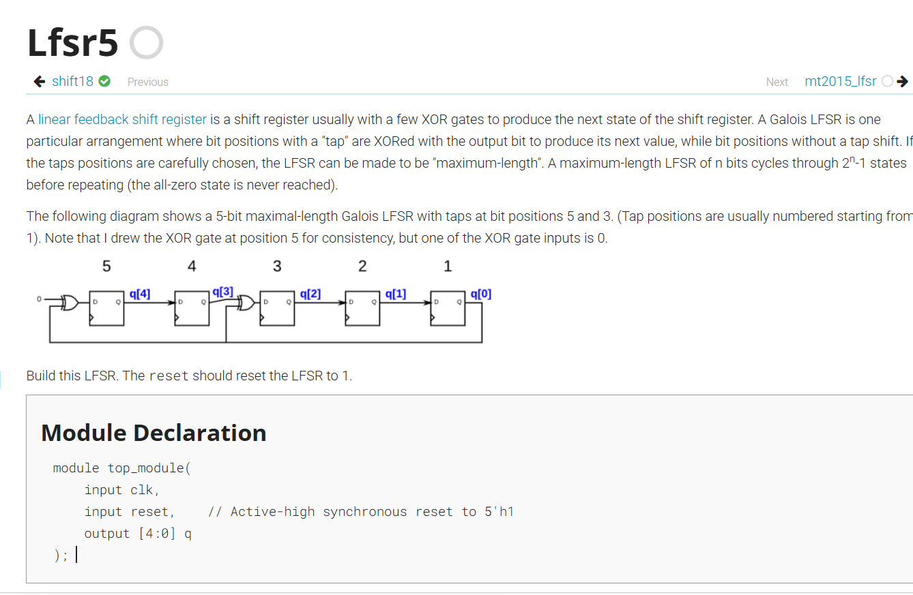

For LFSRs and shift registers, the same timing rule matters. Every bit of the register updates together on the clock edge. If the diagram says `q[2]` gets `q[3] ^ q[0]`, both `q[3]` and `q[0]` are old values from before the edge. Nonblocking assignments model that:

```verilog
always @(posedge clk) begin
    if (reset)
        q <= 5'h1;
    else begin
        q[4] <= q[0];
        q[3] <= q[4];
        q[2] <= q[3] ^ q[0];
        q[1] <= q[2];
        q[0] <= q[1];
    end
end
```

The weakness to watch: drawing a shift register as if assignments happen top-to-bottom. Hardware registers update in parallel. Use nonblocking assignments for clocked logic and reason from the old state to the next state.

## 10. FSMs: State Is Memory, Not Input

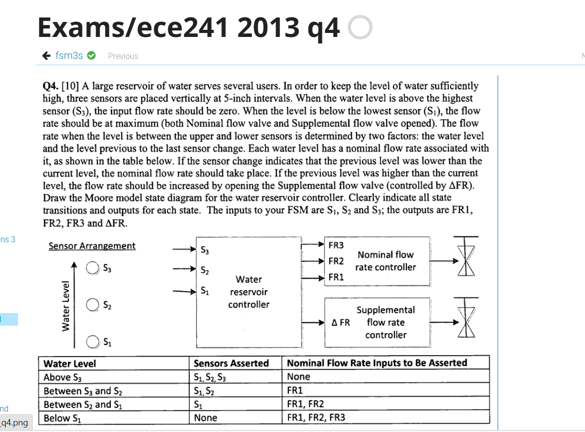

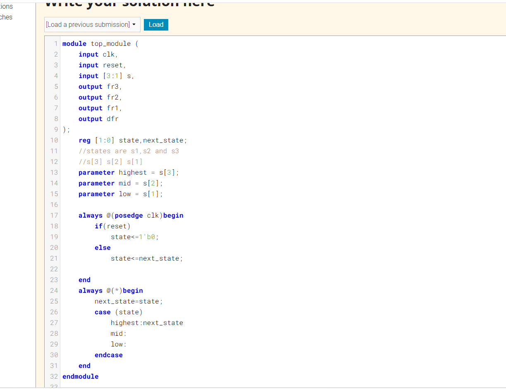

The water reservoir attempt treated things like `s[3]`, `s[2]`, and `s[1]` as if they could be `parameter` state values:

```verilog
parameter highest = s[3];
parameter mid     = s[2];
parameter low     = s[1];
```

That is the wrong abstraction. A `parameter` is a compile-time constant. It cannot represent the current sensor input. More importantly, the FSM state should represent what the circuit remembers, not just what the input is right now.

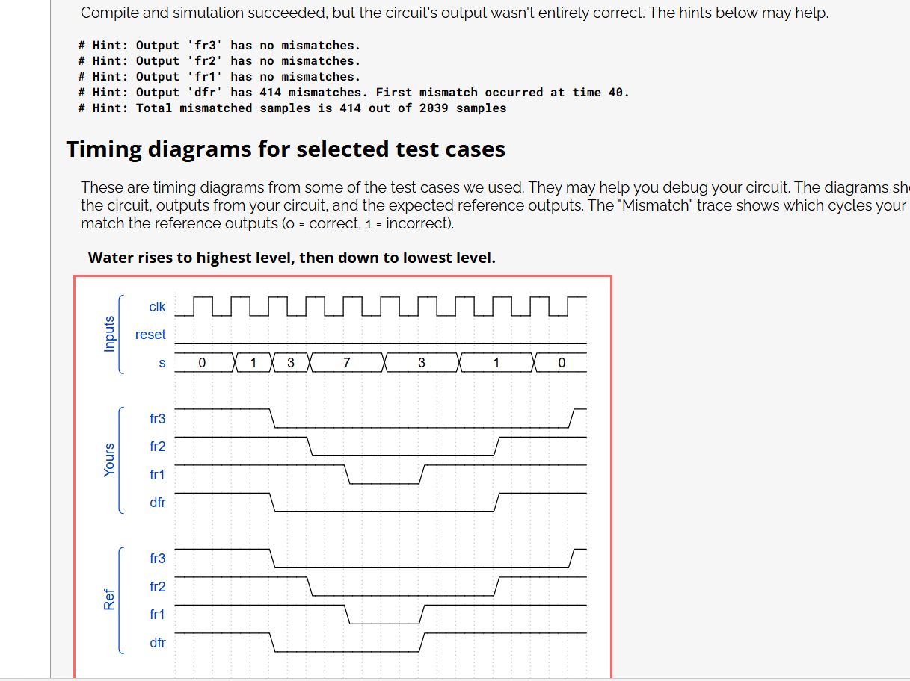

The mismatch shows `fr3`, `fr2`, and `fr1` were correct, but `dfr` was wrong. That means the level-to-flow mapping was mostly right, but the direction memory was not. `dfr` depends on whether the water level is rising or falling. Current sensor level alone is not enough. You need separate states for the same level depending on the direction of travel.

For example, "between S2 and S1 while rising" and "between S2 and S1 while falling" can require different `dfr` values even though the sensor input range looks similar. That is why the robust solution uses states like:

```text
below_s1
between_s1_s2_rising
between_s1_s2_falling
between_s2_s3_rising
between_s2_s3_falling
above_s3
```

FSM design process:

1. List what the circuit must remember after the input changes.
2. Make one state for each distinct memory condition.
3. Write the state transition table.
4. Write output logic from state, not from guesses inside the transition block.
5. Only then write Verilog.


The arbiter FSM reinforces the same lesson. The circuit must remember which requester currently owns the grant. If requester 1 is being served, it should keep the grant while `r[1]` remains asserted. Priority matters when choosing a new owner from idle, but "hold current owner" matters after a grant has already been given.

That is a common FSM weakness: priority logic and state memory are being mixed together. Priority decides transitions out of idle. State decides outputs and holding behavior.

## 11. Reading Simulation Waveforms

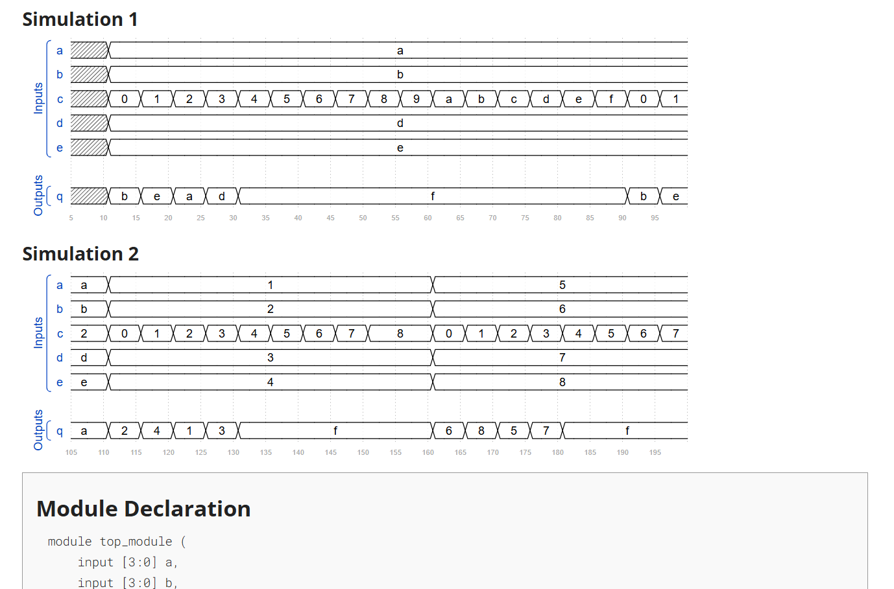

Waveform problems are not about guessing a pretty circuit. They are about extracting a truth table from time.

For the shown waveform, `a`, `b`, `d`, and `e` are held at recognizable values while `c` changes. The output `q` chooses among those values:

```text
c = 0 -> q = b
c = 1 -> q = e
c = 2 -> q = a
c = 3 -> q = d
c >= 4 -> q = 4'hf
```

The way to solve these systematically:

1. Find intervals where only one input changes.
2. Record the output for each input value.
3. Repeat with a second simulation to confirm the mapping is not a coincidence.
4. Convert the mapping into a `case` statement.

```verilog
always @(*) begin
    case (c)
        4'd0: q = b;
        4'd1: q = e;
        4'd2: q = a;
        4'd3: q = d;
        default: q = 4'hf;
    endcase
end
```

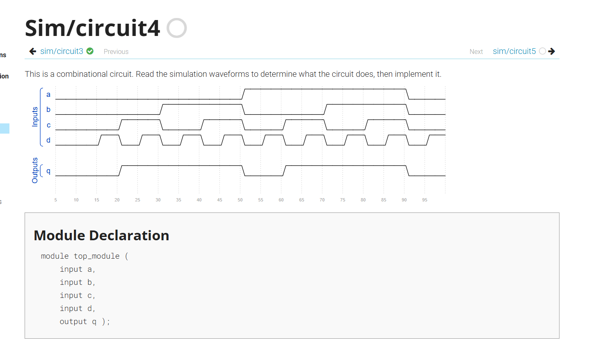

For combinational waveform problems, do not start by coding. First write a mini truth table. If an output changes immediately when an input changes, it is combinational. If it changes only on clock edges, it is sequential. If it follows during a clock level, it is a latch.

## 12. Testbenches: Instantiate Once, Stimulate Over Time

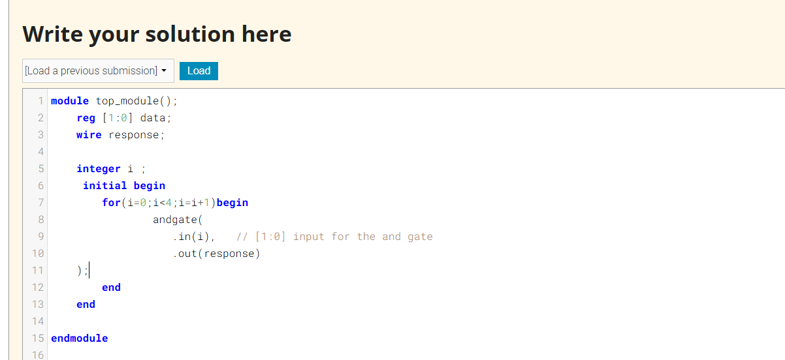

The testbench screenshot instantiated `andgate` inside a `for` loop in an `initial` block. That is a software mental model: "loop four times and create/call the module." Verilog modules are not functions. A module instance is hardware created once during elaboration. You cannot instantiate hardware procedurally inside `initial`.

Correct testbench pattern:

```verilog
module top_module();
    reg [1:0] data;
    wire response;
    integer i;

    andgate dut (
        .in(data),
        .out(response)
    );

    initial begin
        for (i = 0; i < 4; i = i + 1) begin
            data = i;
            #10;
        end
    end
endmodule
```

The DUT exists once. The `initial` block changes the input signal over simulation time. That is the core difference between hardware structure and testbench stimulus.

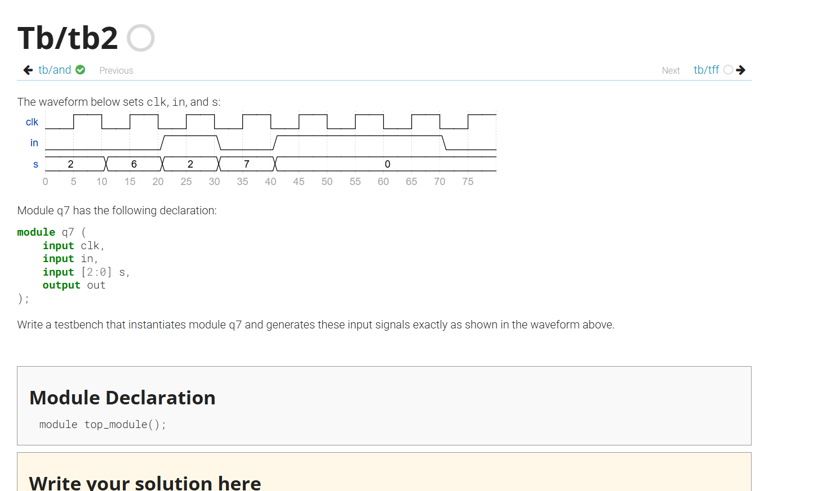

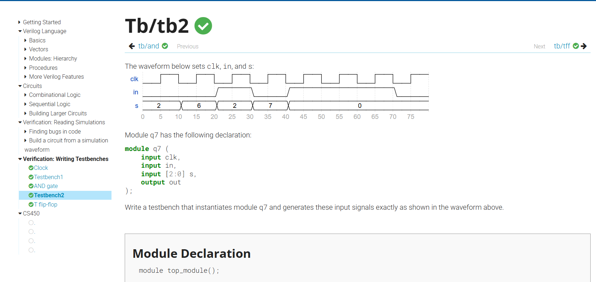

For waveform-driven testbenches, focus on exact timing:

- clock period,
- when each input changes,
- whether changes occur on clock edges or between edges,
- and how long each value must be held.

Testbench HDL is allowed to use delays and procedural loops because it is simulation code, not synthesizable hardware. But the DUT instantiation still belongs at module scope.

## 13. The Complete Timer: Separate Control State and Datapath State

These screenshots belong to [problem 154 — The complete timer](problems/Day%2009/154-exams__review2015_fancytimer.md). The problem-specific note contains the full corrected design and cycle trace; this section records the reusable weakness.

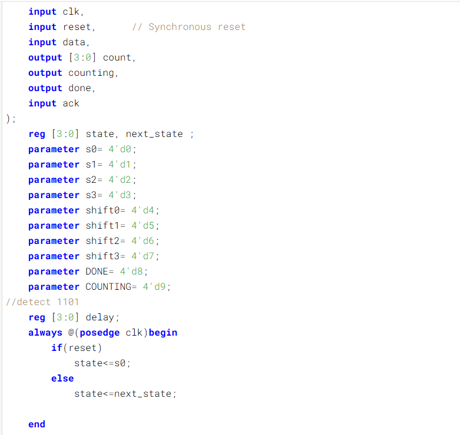

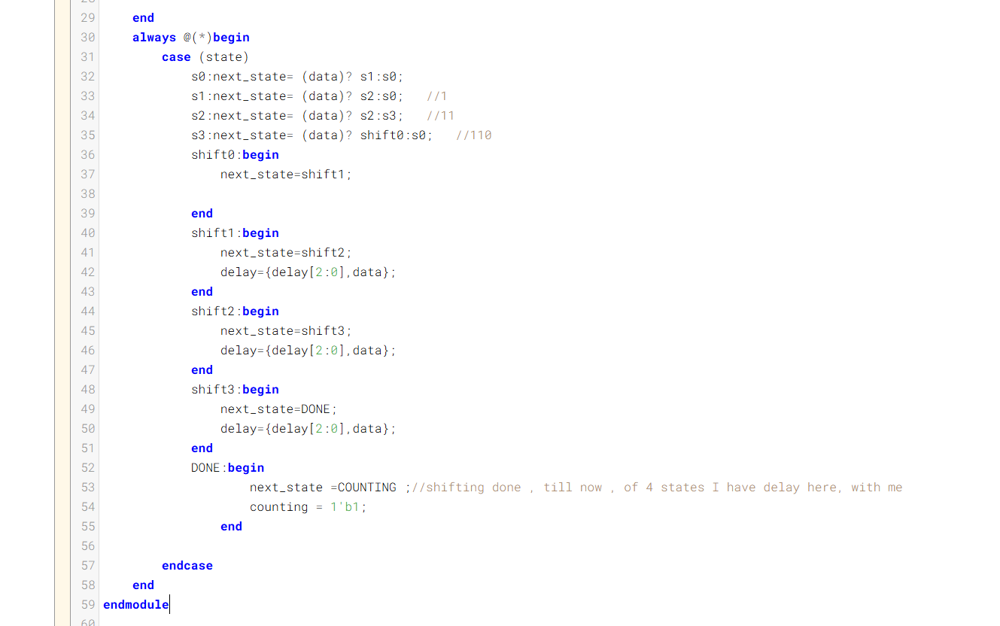

The state list was broadly correct, but the design mixed two kinds of hardware:

- control state: search, shift, count, and wait phases;
- datapath state: the four captured bits and the 0-to-999 subcounter.

`next_state` belongs in combinational logic. `delay` and the counters are stored values and belong in clocked logic. `counting` is a Moore output and should be a complete decode such as `assign counting = (state == COUNT);`. Assigning these only inside selected `case` items creates incomplete paths and obscures the timing.

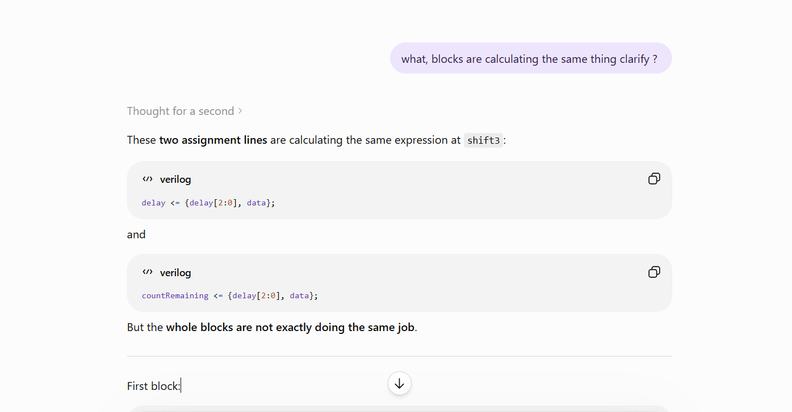

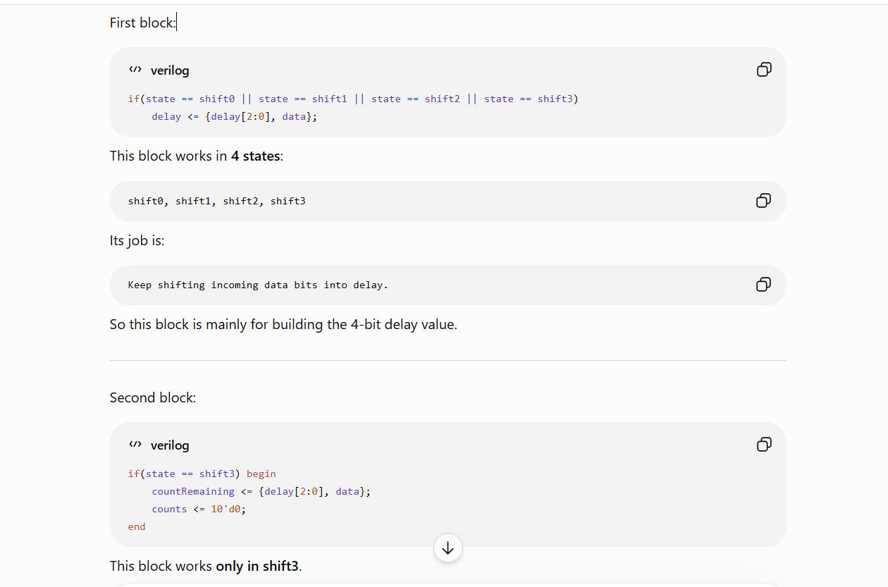

Two assignments can calculate `{delay[2:0], data}` without being redundant if they load different destination registers. The expression is only the next four-bit value. The destination and enable determine the hardware role.

For this timer, a better simplification is to avoid the second register. The same four-bit register shifts during `B0`–`B3`, then counts down during `COUNT`. Those controls never overlap.

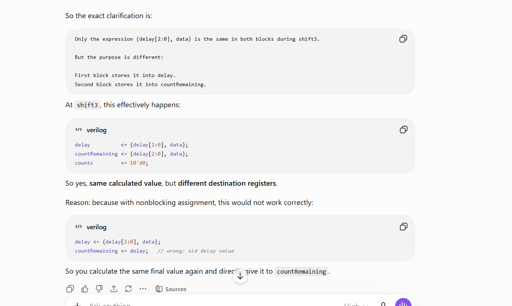

The important timing rule is:

```verilog
delay <= {delay[2:0], data};
countRemaining <= delay;
```

Both right-hand sides are evaluated before the edge updates any register, so `countRemaining` receives the old `delay`. If both registers must capture the new value, both right-hand sides must use `{delay[2:0], data}`. If one register can serve both phases, remove the duplicate and the synchronization problem disappears.

## 14. Lemmings FSM Revision: Falling Must Remember Direction

Lemmings 1 was revisited successfully on 2026-07-04. Its two-state model is correct because the only stored fact is the current walking direction.

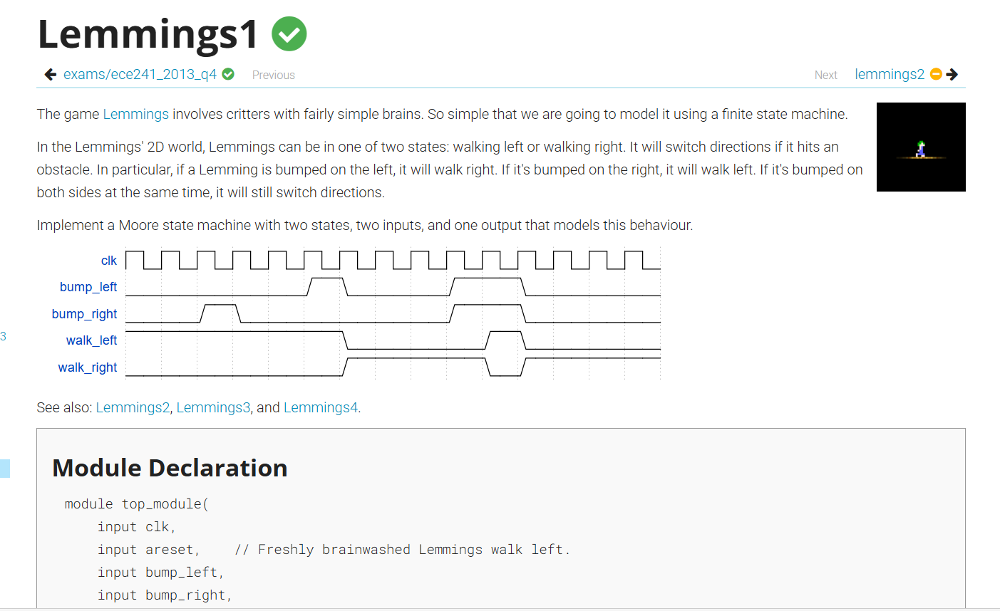

Lemmings 2 adds falling. The full review capture is kept in [Review.md](Review.md); the current question and split editor capture are rendered here in reading order.

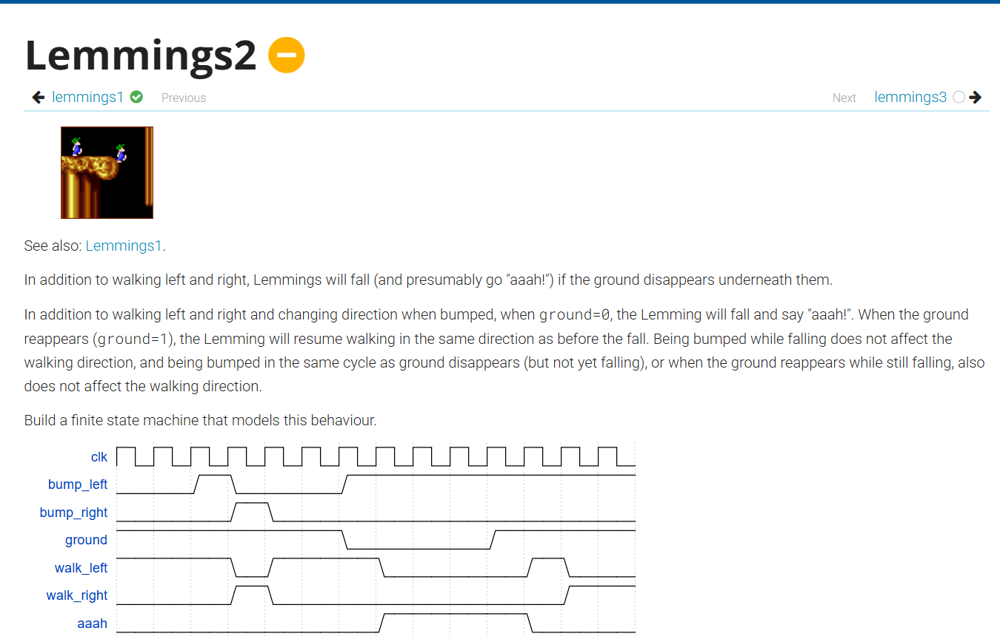

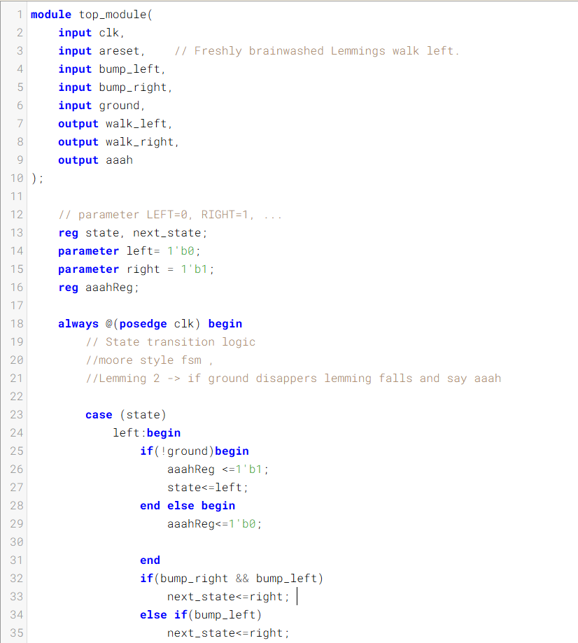

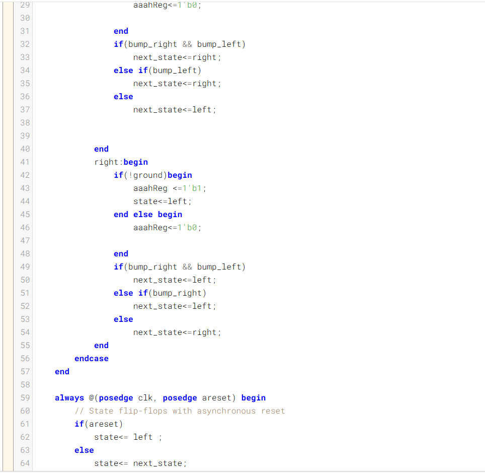

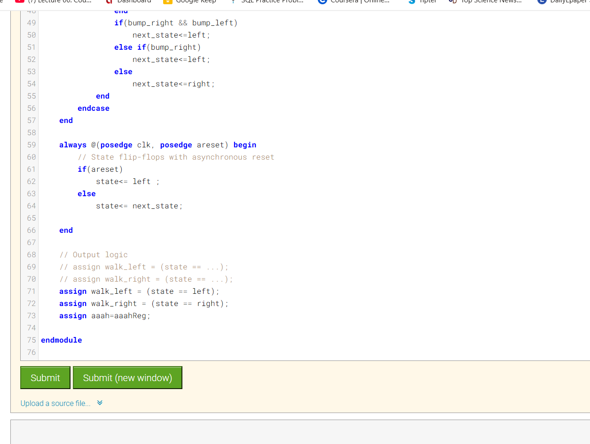

The attempt keeps only one direction bit and uses `aaahReg` as a separate falling flag. That is not enough because a falling Lemming must remember whether it was walking left or right before the ground disappeared. While falling, bumps must be ignored. The clean state space is therefore four Moore states: `WALK_L`, `WALK_R`, `FALL_L`, and `FALL_R`.

The attempt also assigns `state` from two clocked `always` blocks. A register must have one procedural owner. State transition decisions belong in a combinational `always @(*)` block that drives only `next_state`; a single clocked block then performs `state <= next_state` and handles asynchronous reset. The falling output should be decoded from the registered falling states, so a separate sticky `aaahReg` is unnecessary.

Transition priority matters:

1. In a walking state, `ground==0` enters the matching falling state before bump inputs are considered.
2. In a falling state, all bump inputs are ignored.
3. When `ground` returns, `FALL_L` resumes `WALK_L` and `FALL_R` resumes `WALK_R`.

This organization directly implements the wording of the problem and prevents direction changes during a fall.

## Revision Checklist

Before submitting an HDLBits solution, run this checklist:

1. Did I classify the circuit as continuous combinational, procedural combinational, clocked sequential, latch, FSM, or testbench?
2. Are all vector widths counted? Does every concatenation have the expected total width?
3. Are part-select ranges consistent with the declaration direction?
4. Did I use bitwise operators for bit-level hardware?
5. If I used `always @(*)`, does every output get a value on every path unless I intentionally want a latch?
6. If I used `casez`, did I test masks with concrete inputs that have multiple bits set?
7. If I used a generate loop, are instance names unique and are all ports connected?
8. If the problem is sequential, did I separate current state, next state, and outputs?
9. If HDLBits shows a mismatch trace, did I compare the first mismatching output, not the whole waveform at once?
10. If writing a testbench, did I instantiate the DUT once and then drive inputs over time?

## Screenshot Index

These are the technical screenshots kept for this reflection log.

| File | Main topic |
|---|---|
| [001-edaplayground-gate-practice.png](images/Mistakes/001-edaplayground-gate-practice.png) | Gate-level Verilog practice context |
| [002-edaplayground-full-adder-page.png](images/Mistakes/002-edaplayground-full-adder-page.png) | Full-adder practice context |
| [003-full-subtractor-borrow-logic.png](images/Mistakes/003-full-subtractor-borrow-logic.png) | Full subtractor borrow equation |
| [004-full-adder-boolean-operators-cropped.png](images/Mistakes/004-full-adder-boolean-operators-cropped.png) | Full adder carry expression |
| [005-full-adder-carry-expression.png](images/Mistakes/005-full-adder-carry-expression.png) | Logical vs bitwise carry logic |
| [006-ripple-carry-adder-empty-instances.png](images/Mistakes/006-ripple-carry-adder-empty-instances.png) | Structural instantiation and carry chain |
| [007-vector-split-assign-inside-always.png](images/Mistakes/007-vector-split-assign-inside-always.png) | Continuous vs procedural assignment |
| [008-reduction-operators-vector-gates.png](images/Mistakes/008-reduction-operators-vector-gates.png) | Reduction operators |
| [009-concatenation-unsized-constants.png](images/Mistakes/009-concatenation-unsized-constants.png) | Concatenation width |
| [010-vector-reversal-question.png](images/Mistakes/010-vector-reversal-question.png) | Vector reversal |
| [011-nor-uses-verilog-or-keyword.png](images/Mistakes/011-nor-uses-verilog-or-keyword.png) | Verilog operator syntax |
| [012-module-shift8-question.png](images/Mistakes/012-module-shift8-question.png) | Module shift8 problem context |
| [013-module-shift8-wiring-attempt.png](images/Mistakes/013-module-shift8-wiring-attempt.png) | Module wiring attempt |
| [014-module-shift8-case-solution-attempt.png](images/Mistakes/014-module-shift8-case-solution-attempt.png) | Module shift8 solution attempt |
| [015-priority-encoder-mismatch.png](images/Mistakes/015-priority-encoder-mismatch.png) | Priority encoder mismatch |
| [016-priority-encoder-casez-patterns.png](images/Mistakes/016-priority-encoder-casez-patterns.png) | `casez` mask direction |
| [017-scancode-default-assignments-good-pattern.png](images/Mistakes/017-scancode-default-assignments-good-pattern.png) | Default assignments in combinational logic |
| [018-popcount-success-trace.png](images/Mistakes/018-popcount-success-trace.png) | Popcount success trace |
| [019-generate-loop-bcd-part-select.png](images/Mistakes/019-generate-loop-bcd-part-select.png) | Generate loop and BCD slicing |
| [020-bcd-adder-warning-trace.png](images/Mistakes/020-bcd-adder-warning-trace.png) | Stuck output warning |
| [021-combinational-hierarchy-mt2015-q4.png](images/Mistakes/021-combinational-hierarchy-mt2015-q4.png) | Hierarchical combinational circuit |
| [022-gate-level-waveform-mismatch.png](images/Mistakes/022-gate-level-waveform-mismatch.png) | Waveform mismatch |
| [023-kmap2-question.png](images/Mistakes/023-kmap2-question.png) | K-map question context |
| [024-adder100-success.png](images/Mistakes/024-adder100-success.png) | 100-bit adder success |
| [025-signed-overflow-success.png](images/Mistakes/025-signed-overflow-success.png) | Signed overflow success |
| [026-kmap-mux-question.png](images/Mistakes/026-kmap-mux-question.png) | K-map mux mapping |
| [027-kmap-mux-mismatch.png](images/Mistakes/027-kmap-mux-mismatch.png) | K-map mux mismatch trace |
| [028-d-latch-question.png](images/Mistakes/028-d-latch-question.png) | D latch problem |
| [029-dff-xor-circuit-question.png](images/Mistakes/029-dff-xor-circuit-question.png) | DFF plus XOR circuit |
| [030-fsm-circuit-question.png](images/Mistakes/030-fsm-circuit-question.png) | FSM circuit context |
| [031-fsm-circuit-attempt.png](images/Mistakes/031-fsm-circuit-attempt.png) | FSM coding attempt |
| [032-shift-register-stage-question.png](images/Mistakes/032-shift-register-stage-question.png) | Shift-register stage |
| [033-edge-detect-question.png](images/Mistakes/033-edge-detect-question.png) | Edge detection |
| [034-edge-detect-attempt.png](images/Mistakes/034-edge-detect-attempt.png) | Edge detector attempt |
| [035-jk-flipflop-question.png](images/Mistakes/035-jk-flipflop-question.png) | JK flip-flop |
| [036-jk-flipflop-question-full.png](images/Mistakes/036-jk-flipflop-question-full.png) | JK flip-flop context |
| [037-edge-detect-revisit-question.png](images/Mistakes/037-edge-detect-revisit-question.png) | Edge detect revisit |
| [038-edge-detect-solved.png](images/Mistakes/038-edge-detect-solved.png) | Edge detector solved |
| [039-lfsr5-question.png](images/Mistakes/039-lfsr5-question.png) | 5-bit LFSR |
| [040-lfsr32-question.png](images/Mistakes/040-lfsr32-question.png) | 32-bit LFSR |
| [041-shift-register-muxdff-question.png](images/Mistakes/041-shift-register-muxdff-question.png) | Mux-DFF shift register |
| [042-shift-register-muxdff-top-question.png](images/Mistakes/042-shift-register-muxdff-top-question.png) | Top-level mux-DFF shift register |
| [043-hdlbits-progress-summary.png](images/Mistakes/043-hdlbits-progress-summary.png) | HDLBits progress context |
| [044-water-reservoir-fsm-question.png](images/Mistakes/044-water-reservoir-fsm-question.png) | Water reservoir FSM |
| [045-water-reservoir-fsm-attempt.png](images/Mistakes/045-water-reservoir-fsm-attempt.png) | FSM attempt |
| [046-water-reservoir-dfr-mismatch.png](images/Mistakes/046-water-reservoir-dfr-mismatch.png) | Direction flag mismatch |
| [047-sim-circuit8-mismatch.png](images/Mistakes/047-sim-circuit8-mismatch.png) | Circuit8 mismatch |
| [048-sim-circuit8-edge-attempt.png](images/Mistakes/048-sim-circuit8-edge-attempt.png) | Edge-triggered attempt for latch behavior |
| [049-sim-circuit8-question.png](images/Mistakes/049-sim-circuit8-question.png) | Circuit8 question |
| [050-sim-circuit8-edge-attempt-cropped.png](images/Mistakes/050-sim-circuit8-edge-attempt-cropped.png) | Circuit8 attempt detail |
| [051-sim-circuit8-inferred-latch-warning.png](images/Mistakes/051-sim-circuit8-inferred-latch-warning.png) | Intentional latch warning |
| [052-sim-circuit10-question.png](images/Mistakes/052-sim-circuit10-question.png) | Circuit10 question |
| [053-sim-circuit8-mismatch-full.png](images/Mistakes/053-sim-circuit8-mismatch-full.png) | Circuit8 mismatch detail |
| [054-sim-circuit8-counter-attempt.png](images/Mistakes/054-sim-circuit8-counter-attempt.png) | Incorrect counter-based attempt |
| [055-sim-circuit8-mismatch-second.png](images/Mistakes/055-sim-circuit8-mismatch-second.png) | Circuit8 second mismatch |
| [056-sim-circuit8-negedge-counter-attempt.png](images/Mistakes/056-sim-circuit8-negedge-counter-attempt.png) | Negedge counter attempt |
| [057-sim-circuit4-question.png](images/Mistakes/057-sim-circuit4-question.png) | Combinational waveform inference |
| [058-sim-circuit5-waveform-question.png](images/Mistakes/058-sim-circuit5-waveform-question.png) | Mux-like waveform inference |
| [059-sim-circuit5-module-declaration.png](images/Mistakes/059-sim-circuit5-module-declaration.png) | Circuit5 declaration |
| [060-sim-circuit6-question.png](images/Mistakes/060-sim-circuit6-question.png) | Circuit6 waveform |
| [061-sim-circuit10-question-cropped.png](images/Mistakes/061-sim-circuit10-question-cropped.png) | Circuit10 context |
| [062-sim-circuit10-module-declaration.png](images/Mistakes/062-sim-circuit10-module-declaration.png) | Circuit10 declaration |
| [063-sim-circuit10-waveform-fragment.png](images/Mistakes/063-sim-circuit10-waveform-fragment.png) | Circuit10 waveform fragment |
| [064-testbench-andgate-loop-attempt.png](images/Mistakes/064-testbench-andgate-loop-attempt.png) | Testbench module instantiation mistake |
| [065-tb2-question.png](images/Mistakes/065-tb2-question.png) | Testbench2 waveform |
| [066-tb2-question-full.png](images/Mistakes/066-tb2-question-full.png) | Testbench2 full context |
| [067-tb2-solved.png](images/Mistakes/067-tb2-solved.png) | Testbench2 solved |
| [068-fsm-q2afsm-state-diagram.png](images/Mistakes/068-fsm-q2afsm-state-diagram.png) | FSM state diagram |
| [069-fsm-arbiter-q2afsm-full.png](images/Mistakes/069-fsm-arbiter-q2afsm-full.png) | FSM arbiter full problem |
| [070-fancytimer-wrong-attempt-state-and-registers.png](images/Mistakes/070-fancytimer-wrong-attempt-state-and-registers.png) | Complete timer state/register attempt |
| [071-fancytimer-wrong-attempt-next-state-logic.png](images/Mistakes/071-fancytimer-wrong-attempt-next-state-logic.png) | Next-state logic mixed with datapath updates |
| [072-fancytimer-review-duplicate-expression-question.png](images/Mistakes/072-fancytimer-review-duplicate-expression-question.png) | Question about two identical shift expressions |
| [073-fancytimer-review-shift-versus-load.png](images/Mistakes/073-fancytimer-review-shift-versus-load.png) | Continuous shifting versus final countdown loading |
| [074-fancytimer-review-nonblocking-old-value.png](images/Mistakes/074-fancytimer-review-nonblocking-old-value.png) | Nonblocking assignments read pre-edge values |
| [075-lemmings1-revision-success.png](images/Mistakes/075-lemmings1-revision-success.png) | Successful Lemmings 1 revision check |
| [076-lemmings2-question-waveform.png](images/Mistakes/076-lemmings2-question-waveform.png) | Lemmings 2 falling behavior and waveform |
| [077-lemmings2-attempt-top.png](images/Mistakes/077-lemmings2-attempt-top.png) | Lemmings 2 attempt declarations and first state branch |
| [078-lemmings2-attempt-middle.png](images/Mistakes/078-lemmings2-attempt-middle.png) | Lemmings 2 attempt transition and state-register overlap |
| [079-lemmings2-attempt-bottom.png](images/Mistakes/079-lemmings2-attempt-bottom.png) | Lemmings 2 attempt outputs and submission controls |
