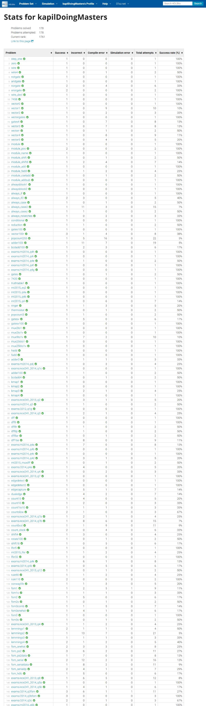

# HDLBits Review Queue

The logged-in HDLBits audit reports **178 solved** and **178 attempted**. There are no active review items: every HDLBits question in this archive is now completed.

## Remaining untouched questions

| Status | Problem | HDLBits ID | Live evidence | Source |
|---|---|---|---|---|
| Done | Conway's Game of Life 16x16 | `conwaylife` | Successful submission verified on 2026-07-07 at 1:36:17 PM | [HDLBits](https://hdlbits.01xz.net/wiki/conwaylife) |
| Done | FSM: One-hot logic equations | `exams/review2015_fsmonehot` | Successful submission verified on 2026-07-07 at 12:49:56 PM | [HDLBits](https://hdlbits.01xz.net/wiki/exams/review2015_fsmonehot) |

No untouched questions remain.

## Live profile evidence

## Promoted from review

[Q2a: Arbiter FSM](problems/Day%2014/177-exams__2013_q2afsm.md), [FSM: One-hot logic equations](problems/Day%2014/178-exams__review2015_fsmonehot.md), and [Conway's Game of Life 16x16](problems/Day%2014/179-conwaylife.md) were successfully completed on 2026-07-07. Their problem notes render the verified Chrome evidence and saved Verilog.

Every promoted item has a complete question-and-loaded-answer screenshot, saved Verilog, exact timestamp, and live attempt statistics.
